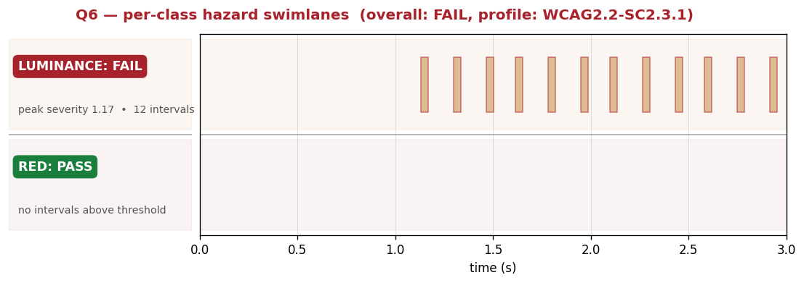

# Q6 — open PSE-detection benchmark + standards-grounded detector

[](https://github.com/qwertey6/Q6/actions/workflows/test.yml)

Q6 is a reproducible benchmark for **photosensitive-epilepsy (PSE) detection
in video**, plus a detector implemented from the *text* of the standards
(WCAG 2.2 SC 2.3.1, Trace24, ITU-R BT.1702, Ofcom GN2 Annex 1, NAB-J,
ISO 9241-391) — not tuned against benchmark labels.

It exists because, despite PSE being a well-studied harm (the 1997
Pokémon *Porygon* incident triggered seizures in ~700 viewers in Japan
and is what spurred most of the regional broadcasting rules), there's no
public, cross-standards, cross-tool benchmark. We built one.

## Headline numbers

Q6's classical detector evaluated on TRACE's public corpus
(`pse-test-media`, BSD-3) — same fixtures, same labels, every tool
running through an identical harness with strict adapter / label
isolation:

| tool                          | MCC    | F2    | AUROC | recall | spec  | FN | FP |
|---|---|---|---|---|---|---|---|
| **Q6 (classical) @ WCAG2.2**  | +0.220 | 0.537 | 0.615 | 0.587  | 0.654 | 38 | 81 |
| **Q6 (classical) @ NAB-J**    | +0.329 | 0.487 | 0.707 | **0.882** | 0.770 | **2** | 71 |
| **Q6 (classical) @ ITU/Ofcom**| +0.387 | 0.568 | 0.644 | 0.750  | 0.826 | 7  | 52 |
| IRIS @ WCAG2.2 †              | -0.037 | 0.029 |  —    | 0.024  | 0.961 | 82 |  9 |
| FFmpeg `vf_photosensitivity`  | -0.067 | 0.118 | 0.527 | 0.107  | 0.839 | 75 | 37 |
| Kaya 2025 (samfatu) @ WCAG2.2 † | -0.070 | 0.094 | 0.472 | 0.083 | 0.865 | 77 | 31 |
| Q6 (MLP) @ WCAG2.2            | -0.090 | 0.285 | 0.488 | 0.310  | 0.591 | 58 | 94 |
| flickerfilter (existing ML)   |  0.000 | 0.000 | 0.495 | 0.000  | 1.000 | 84 |  0 |
| Apple VFR                     |   —    |  —    |  —    |   —    |   —   |  — |  — (API unreachable in our env) |

**†** marks tools whose underlying interpretation of the WCAG area
clause is materially looser than the WCAG-strict reading TRACE labels
assume. IRIS implements Harding-classic (~87,296 px floor on
contiguous active area); Kaya 2025 reads "any 341×256 rectangle" as
"any 1/3 × 1/3 frame cell" (~57,600 px floor on 1920×1080). WCAG-strict
puts the floor at ~21,824 px via a sliding reference rectangle. A low
MCC under those rows reads as "the tool targets a looser interpretation
than the labels assume" rather than "the tool is broken." Full
diagnostic in
[`detector/ml/SANITY_CHECKS.md`](detector/ml/SANITY_CHECKS.md) Checks 3
and 5.

A learned detector stacked on Q6's per-frame trace (`A6` in our sweep —
5-fold CV on TRACE) reaches **MCC +0.355**, a +0.155 absolute lift over
the classical baseline on the same 293-sample subset, and the only
non-zero MCC any published ML PSE detector reaches on this corpus.

Methodology and per-approach numbers live in
[`detector/ml/EXPERIMENTS.md`](detector/ml/EXPERIMENTS.md). Cross-checks
on the ML headline and one real adapter bug we caught in
`vf_photosensitivity` are in
[`detector/ml/SANITY_CHECKS.md`](detector/ml/SANITY_CHECKS.md).

## What Q6 produces per fixture

A multi-resolution structure capturing **where, when, and why** content
is hazardous, plus how to fix it:

  - **Verdict + continuous severity score** at fixture level
  - **Per-axis aggregates** (luminance / red / pattern / count): verdict,
    peak windowed transition count, peak hazard area, fail intervals,
    margin to threshold
  - **Per-frame hazard regions** — a list per frame, each with bbox,
    centroid, set of triggered hazard classes, per-class severity,
    confidence band (marginal / clear / severe), structured mitigation
    hints with alternatives, linked standards clauses, and a
    counterfactual ("would PASS if...")
  - **Per-class swimlane chart** — one-glance answer to "did this video
    have hazards, of which class, and when":

    

    *(60 fps, full-screen 31 Hz flash. The luminance lane carries a red
    FAIL chip and twelve interval bars at the burst times; the
    red-flash lane shows a green PASS chip and stays empty. Lanes are
    PSE-safe by construction: bars are continuous spans that cannot
    flicker, severity is encoded inside each bar via fill darkness,
    and the verdict chip in each lane header makes a single-frame
    FAIL just as visually loud as a sustained one.)*

A per-fixture HTML report wraps all of the above into one self-contained
file suitable for content creators / accessibility reviewers.

## Quickstart

```bash
git clone https://github.com/qwertey6/Q6
cd Q6
pip install -r requirements.txt

# self-test the detector (no corpus needed)
python3 -m detector --self-test

# render a per-fixture HTML report on a sample video
python3 -m report.fixture_report path/to/video.mp4
# → report/out/video.html + video.heatmap.png

# full reproducible benchmark (downloads corpus, runs all adapters, scores)
make all
```

`make all` produces `results/scores/scores.{json,csv}` and per-fixture
HTML reports under `report/out/`. `make corpus` / `make harness` /
`make report` run the milestones independently.

## Standards coverage

Each profile implements the standard's text directly; thresholds are
cited clause-by-clause in
[`detector/THRESHOLDS.md`](detector/THRESHOLDS.md):

  - **WCAG 2.2 SC 2.3.1** (W3C accessibility) — strict reading
  - **WCAG 2.2 classic** — Harding-rectangle area reading (looser)
  - **Trace24** — TRACE's proposed stricter guideline (Jordan &
    Vanderheiden, 2024)
  - **ITU-R BT.1702** — international TV broadcast baseline
  - **Ofcom GN2 Annex 1** — UK broadcast
  - **NAB-J / J-BA** — Japan (post-Pokémon Shock guidelines)
  - **ISO 9241-391** — ergonomics / accessibility cross-cut

Per-fixture labels for the first five come from TRACE's `pse-test-media`
corpus. **NAB-J labels are derived analytically** (see
`corpus/derive_per_standard_labels.py`) — this is internal consistency,
not external validation; the script documents the derivation honestly.

## Layout

```
corpus/        labeled fixtures (TRACE/pse-test-media + 45 Q6-extended synthetic)
                + MANIFEST.csv with per-standard label columns
                + PROVENANCE.md (how the corpus was constructed)
detector/      Q6 detector (classical + ML)
                + THRESHOLDS.md (every numeric constant cited to a clause)
                + ml/ — A1–A6 experiment sweep + writeups
harness/       benchmark runner, adapters (Q6, IRIS, ffmpeg, flickerfilter,
                Apple VFR, Q6 MLP), normalized-result schema, scoring
report/        comparative report + per-fixture HTML + heatmaps
```

Adapter / label isolation is the non-gameable invariant: the runner
reads only fixture paths from the manifest, never labels; scoring joins
to labels in a separate pass. No adapter has privileged access.

## License

[**PolyForm Noncommercial 1.0.0**](LICENSE). Personal / academic /
public-research / public-health / government use is granted. Commercial
licensing is available by contact.

Third-party components retain their upstream licenses; see
[`THIRD_PARTY_NOTICES.md`](THIRD_PARTY_NOTICES.md).

## Deeper docs

  - **[`detector/THRESHOLDS.md`](detector/THRESHOLDS.md)** — every
    numeric threshold + its clause citation; open-questions log
  - **[`detector/ml/EXPERIMENTS.md`](detector/ml/EXPERIMENTS.md)** —
    A1–A6 ML sweep, methodology + per-approach numbers + conclusions
  - **[`detector/ml/SANITY_CHECKS.md`](detector/ml/SANITY_CHECKS.md)** —
    cross-checks on the ML headline; real adapter bug found and fixed
  - **[`corpus/PROVENANCE.md`](corpus/PROVENANCE.md)** — how the corpus
    was assembled, what's where, how to reproduce
  - **[`PLAN.md`](PLAN.md)** — original architecture document
    (mostly historical now)

## Contributing

External contributions are welcome — please open an issue or draft PR
before substantial changes. A Contributor License Agreement (CLA) is
required for non-trivial contributions; light fixes don't need one.

## Disclaimer

This repository is engineering tooling, not legal advice. Q6's verdicts
should not be the sole basis for production-content compliance
decisions. Before any public publication of benchmark results or
commercial release, the licensing and any redistribution of
generated/derived media should be reviewed by counsel. We claim no
endorsement from any upstream project or standards body.
